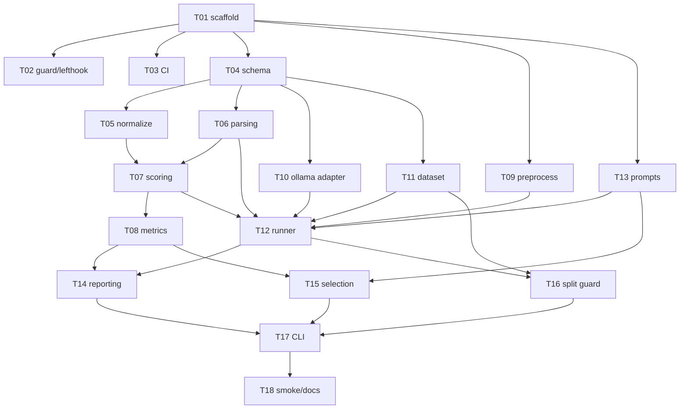

# ADR-0001 実装タスクリスト

[ADR-0001「Ollama を用いた生産指示書 OCR ベンチマーク基盤」](../adr/0001-local-ocr-benchmark-architecture.md)
を、コーディングエージェント（Codex）が **1 タスク = 1 セッション = 1 PR** で実装できる粒度に分解したもの。

- 実装タスク: T01〜T18（Codex に依頼する）
- 運用タスク: H1〜H5（人間が実施する。データ収集・実機評価など。本ファイル末尾）

## Codex への渡し方

1 タスクごとに、次の 3 ファイルをコンテキストへ含めて依頼する。

1. `adr/0001-local-ocr-benchmark-architecture.md` — 仕様の正本
2. `tasks/README.md` — このファイル。共通規約とインターフェース早見表
3. `tasks/TXX-*.md` — 当該タスク

プロンプト雛形:

> tasks/TXX-….md のタスクを実装してください。「実装指示」に従い、「受け入れ基準」と「テスト要件」を
> すべて満たしてください。完了前に `uv run ruff check .`、`uv run ruff format --check .`、
> `uv run mypy`、`uv run pytest` がすべて成功することを確認してください。
> タスクファイルと ADR が矛盾する場合は ADR を優先し、矛盾内容を PR 説明へ記載してください。

- タスク一覧表の順（T01 → T18）に着手すれば依存は常に満たされる。並行開発する場合は依存グラフを参照。
- 各タスクの「提供インターフェース」は後続タスクとの契約。変更が必要になった場合は、後続タスクファイルの
  追従修正を同じ PR で行い、理由を PR 説明へ書く。
- タスクに書かれていない細部（変数名、内部構造、エラーメッセージ文言など）は実装者の裁量とする。

## 共通規約（全タスクに適用）

### リポジトリ構成（T17 完了時点の目標形）

```text
.
├── adr/
├── tasks/
├── prompts/                    # プロンプト版管理（T13、Git 管理する）
├── docs/                       # Windows 手順・隔離運用手順（T16, T18）
├── scripts/
│   └── guard_staged_files.py   # commit ガード（T02）
├── src/ocrbench/
│   ├── __init__.py
│   ├── py.typed
│   ├── config.py               # 定数・環境変数（T01）
│   ├── schema.py               # 抽出スキーマ（T04）
│   ├── normalize.py            # 正規化（T05）
│   ├── parsing.py              # 厳密 JSON パース（T06）
│   ├── scoring.py              # 採点（T07）
│   ├── metrics.py              # 集計・統計（T08)
│   ├── preprocess.py           # 画像前処理（T09）
│   ├── ollama_adapter.py       # Ollama adapter + fake（T10）
│   ├── dataset.py              # manifest・分割・fingerprint（T11）
│   ├── runner.py               # 実行エンジン（T12）
│   ├── results.py              # results.json データモデル（T12）
│   ├── prompts.py              # プロンプトレジストリ（T13）
│   ├── reporting.py            # report.md・匿名集計（T14）
│   ├── selection.py            # 候補採用・選定・停止判定（T15）
│   ├── splitguard.py           # split ガード（T16）
│   ├── smoke.py                # smoke test（T18）
│   └── cli.py                  # argparse CLI（T01 スタブ → T17 統合）
└── tests/
    ├── fixtures/public/        # 匿名 fixture のみ Git 管理可（ADR §5）
    └── test_*.py
```

### 技術スタック

- Python 3.14、`uv`（`pyproject.toml` + `uv.lock` を Git 管理）、src layout、パッケージ名 `ocrbench`
- CLI コマンド名 `ocrbench`。標準ライブラリ `argparse` を使用（Click / Typer 等の追加 CLI 依存は禁止）
- ランタイム依存は **pydantic / pillow / pypdfium2 / ollama の 4 つに限定**。
  追加が必要になった場合は PR 説明に理由を明記する
- 統計処理（Wilson 信頼区間、bootstrap、McNemar、percentile）は純 Python で自前実装する
  （numpy / scipy を追加しない。データ規模 100 件 × 5 モデルでは不要）
- 時刻は UTC。タイムスタンプ表記は `YYYYMMDDTHHMMSSZ`

### 品質ゲート（全 PR 共通の完了条件）

- `uv run ruff check .`
- `uv run ruff format --check .`
- `uv run mypy`（strict mode）
- `uv run pytest`（既定で `-m "not ollama"`、カバレッジ全体 80% 以上）
- 実 Ollama が必要なテストは `@pytest.mark.ollama` を付け、通常実行・Lefthook・CI から除外（ADR §11）

### 機密データ規則（ADR §5）

- 実帳票・正解 JSON・個別予測・詳細差分を**リポジトリへコミットしない**
- Git 管理してよい fixture は `tests/fixtures/public/` 配下の**合成・匿名データのみ**
- テストで画像・PDF が必要なときは、可能な限りテストコード内で生成する（バイナリのコミットを避ける）
- 実データ・実行結果はすべて下記の環境変数が指すリポジトリ外ディレクトリへ置く

### 環境変数と主要定数

| 名前 | 意味 |
|---|---|
| `OCRBENCH_DATA_DIR` | Development / Selection データセットのルート（リポジトリ外） |
| `OCRBENCH_FINAL_DIR` | Final test データセットのルート（別 Windows ユーザー + NTFS ACL で隔離） |
| `OCRBENCH_RUNS_DIR` | `runs/` 出力先（リポジトリ外） |
| `OCRBENCH_ALLOW_FINAL` | `1` のときだけ final split の実行を許可（CLI `--confirm-final` と併用、T16） |
| `OCRBENCH_ADAPTER` | `real`（既定）/ `fake`。E2E テスト・デモ用 |

- 乱数 seed・推論 seed は `config.SEED = 20260721` に統一（T01）
- 許可モデル 5 種は `config.ALLOWED_MODELS`（ADR §6、T01）
- 前処理バージョンは `preprocess.PREPROCESS_VERSION`（T09）

### モジュール間インターフェース早見表

| 型 / 関数 | 定義タスク | 主な利用者 |
|---|---|---|
| `config.SEED`, `config.ALLOWED_MODELS`, env 読み取り関数 | T01 | 全タスク |
| `OrderDocument`, `LineItem`, `ollama_format_schema()`, `compute_needs_review()` | T04 | T06, T07, T10, T12 |
| `strip_outer_whitespace()`, `comparable_header()`, `comparable_items()` | T05 | T07 |
| `ParseStatus`, `ParseResult`, `parse_model_output()` | T06 | T07, T12 |
| `DocumentScore`, `score_document()` | T07 | T08, T12 |
| `wilson_interval()`, `bootstrap_ci()`, `mcnemar_exact()`, `aggregate()`, `RunSummary`, `reproducibility()` | T08 | T14, T15, T17 |
| `PreprocessResult`, `preprocess()` | T09 | T12, T18 |
| `OllamaAdapter`（Protocol）, `RealOllamaAdapter`, `FakeOllamaAdapter`, `ChatResult`, `GpuPlacement` | T10 | T12, T17, T18 |
| `Manifest`, `DocEntry`, `load_manifest()`, `dataset_fingerprint()`, `build_manifest()` | T11 | T12, T16, T17 |
| `DocumentResult`, `RunManifest`, `run_benchmark()`, results.json スキーマ | T12 | T14, T15, T16, T17 |
| `PromptVersion`, `add_prompt()`, `get_active()`, `activate()`, `rollback()` | T13 | T12, T15, T17 |
| `render_report()`, `export_anonymous_summary()`, `render_detail_report()` | T14 | T17 |
| `is_adoptable()`, `pick_best()`, `should_stop()`, `LoopState` | T15 | T17 |
| `resolve_split_dir()`, `ensure_final_allowed()` | T16 | T12, T17 |

## タスク一覧

| ID | タスク | Phase | 依存 | ADR 参照 |
|---|---|---|---|---|
| [T01](T01-project-scaffold.md) | プロジェクト初期化と品質ツールチェーン | 0 基盤 | – | §11 |
| [T02](T02-secrets-guard-lefthook.md) | .gitignore・Lefthook・機密データ commit ガード | 0 基盤 | T01 | §5, §11 |
| [T03](T03-github-actions-ci.md) | GitHub Actions CI | 0 基盤 | T01 | §11 |
| [T04](T04-extraction-schema.md) | 抽出スキーマとデータ契約 | 1 コア | T01 | §2 |
| [T05](T05-normalization.md) | 正規化ユーティリティ | 1 コア | T04 | §2 |
| [T06](T06-strict-json-parsing.md) | 厳密 JSON パースとスキーマ検証 | 1 コア | T04 | §2 |
| [T07](T07-scoring-engine.md) | 採点エンジン | 1 コア | T05, T06 | §2, §9 |
| [T08](T08-metrics-statistics.md) | メトリクス集計と統計 | 1 コア | T07 | §9 |
| [T09](T09-image-preprocessing.md) | 画像前処理パイプライン | 2 実行系 | T01 | §3 |
| [T10](T10-ollama-adapter.md) | Ollama adapter と fake 実装 | 2 実行系 | T04 | §6, §7, §11 |
| [T11](T11-dataset-manifest.md) | データセット manifest・分割・fingerprint | 2 実行系 | T04 | §4 |
| [T12](T12-benchmark-runner.md) | ベンチマーク実行エンジンと results.json | 2 実行系 | T06, T07, T09, T10, T11, T13 | §7, §10 |
| [T13](T13-prompt-registry.md) | プロンプトレジストリ（版管理） | 2 実行系 | T01 | §8 |
| [T14](T14-reporting.md) | report.md 生成と匿名集計エクスポート | 2 実行系 | T08, T12 | §5, §10 |
| [T15](T15-candidate-selection.md) | 候補自動採用・盲検選定・停止判定 | 2 実行系 | T08, T13 | §8 |
| [T16](T16-split-guard-isolation.md) | split ガードと Final test 隔離補助 | 2 実行系 | T11, T12 | §4, §5, §8 |
| [T17](T17-cli-integration.md) | CLI 統合と fake E2E | 3 統合 | T14, T15, T16 | §11 全般 |
| [T18](T18-smoke-windows-docs.md) | smoke コマンドと Windows セットアップ手順書 | 3 統合 | T17 | §6, §7, Impl. Order 2 |

## 依存グラフ



並行開発の目安: T02・T03 は T01 直後から並行可。T05・T06、および T09・T10・T11・T13 はそれぞれ並行可。
T12 が最大の合流点。

## 運用タスク（Codex 対象外・人間が実施）

| ID | タスク | ADR 参照 | 前提 | 内容 |
|---|---|---|---|---|
| H1 | Windows 実機セットアップと smoke test | §6, Impl. Order 2 | T18 | `docs/windows-setup.md` に従い uv / Ollama / モデル 5 種を導入し、`ocrbench smoke` で 1 モデル・1 帳票を確認。Ollama バージョンと各モデル digest を記録 |
| H2 | データ収集・正解作成・分割確定 | §4, Impl. Order 3 | T11, T17 | 異なる原本 100 件（スキャン 50 / 写真 50）を `OCRBENCH_DATA_DIR` / `OCRBENCH_FINAL_DIR` へ配置。GT JSON を作成し、Final test 分は作成者と別の人が原本照合。`ocrbench dataset build-manifest` → `validate --strict-counts` → `fingerprint` で固定 |
| H3 | Final test の OS レベル隔離 | §5 | T16 | `docs/isolation-windows.md` に従い、別 Windows ユーザーと NTFS ACL で `OCRBENCH_FINAL_DIR` を隔離。チェックリストで検証 |
| H4 | 5 モデル一次評価と上位 2 モデル選定、プロンプト自動改善ループ | §8-1〜5, Impl. Order 4–5 | H1, H2 | 共通初期プロンプトで Development 40 件 × 5 モデルを `ocrbench run`。精度と 30 秒制約で上位 2 モデルを選び、エージェントに CLI（`export-summary` / `prompt add` / `select`）だけを使わせて最大 10 候補を改善。Selection 20 件は一括実行し `pick-best` で盲検選定 |
| H5 | Final test 実行と研究発表レポート | §8-6, §9, §10, Impl. Order 6–7 | H3, H4 | 隔離環境で Final 40 件 × 3 回実行（第 1 回が主精度）。`ocrbench report` / `compare-runs` で集計し、`analysis.md` の考察と合わせて研究発表資料を作成 |

## 進捗管理

PR がマージされたらチェックする。

- [ ] T01 / - [ ] T02 / - [ ] T03 / - [ ] T04 / - [ ] T05 / - [ ] T06
- [ ] T07 / - [ ] T08 / - [ ] T09 / - [ ] T10 / - [ ] T11 / - [ ] T12
- [ ] T13 / - [ ] T14 / - [ ] T15 / - [ ] T16 / - [ ] T17 / - [ ] T18
- [ ] H1 / - [ ] H2 / - [ ] H3 / - [ ] H4 / - [ ] H5
